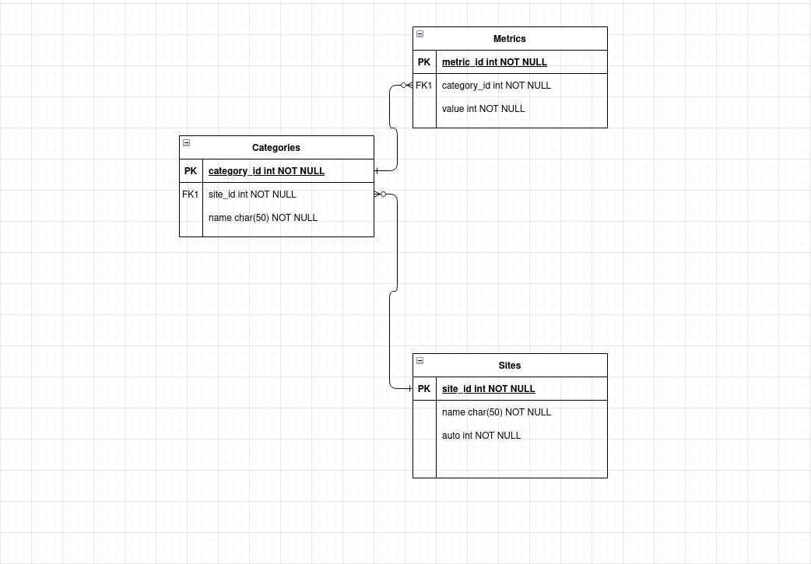

## Metrics App


## Database Schema
  

## How to Use
To setup files and the app run

```
bundle install
```

```
rails db:setup
```

To run test suite
```
bundle exec rspec 
```
## API Documentation

#### Site
###### List all sites
     GET api/v1/sites
```
[
  {
    "id": 1,
    "name": "Food",
    "auto": "inactive"
  },
  {
    "id": 2,
    "name": "Hello",
    "auto": "inactive"
  },
]
```

###### Create site
     POST api/v1/sites
```
  {
    "name": "Yelp",
    "auto": "active"
  }
```
###### Edit site
    PATCH api/v1/sites/:id
 ```
  {
    "name": "Yelp",
    "auto": "active"
  }

 ```
###### Delete site
	DELETE api/v1/sites/:id


#### Category
###### List all categories
     GET api/v1/sites/:site_id/categories

     ```
     [
        {
            "id": 1,
            "name": "Beans",
            "site_id": 1
        },
        {
            "id": 5,
            "name": "Rice",
            "site_id": 1
        }
     ]
     ```
###### Create categories
     POST api/v1/categories
```
    {
    "name": "China",
    "site_id": 1
    }
```
###### Edit categories
    PATCH api/v1/categories/:id
```
    {
    "name": "China",
    "site_id": 1
    }

 ```

###### Delete categories
	DELETE api/v1/categories/:id


#### Metric
###### List all metrics
     GET api/v1/sites/:site_id/metrics
```
[
  {
    "id": 1,
    "value": 56,
    "created_at": "2022-01-10T01:15:41.404Z",
    "category": {
      "id": 1,
      "name": "EbaCol",
      "site_id": 1
    }
  },
  {
    "id": 2,
    "value": 32,
    "created_at": "2022-01-10T01:15:41.408Z",
    "category": {
      "id": 1,
      "name": "EbaCol",
      "site_id": 1
    }
  }
  ]
```

###### Create metric
     POST api/v1/metrics
```
  {
    "value": 56,
    "category_id": 1
  }
```
###### Edit metric
    PATCH api/v1/metrics/:id
 ```
  {
    "value": 56,
    "category_id": 1
  }

 ```
###### Delete metric
	DELETE api/v1/metrics/:id

## Description
- There are three entities created in this project (site, category, metric)
- The Site entity gives users the ability to create a metrics board for each site or data board.
- The Category entity handles the categorization of metrics , it can be used as a filter for metrics.
- The Metrics entity includes all list of metric values available for the chart.

## Technologies Used
- Ruby on Rails - the web framework used to build the api .
- Rspec - testing framework
- PostgreSQL -  the main reason PostgreSQL is used , in a case where there is a migration failure while modifying your database records , the entire modification gets rolled back to where you started instead of crashing like  MySQL.
- Annotate - Adds a comment summarizing the current schema for each models.
- Rubocop - a framework to make sure developers are in line with best practices.
- ByeBug - a gem for debugging in rails.
- Power Types - this framework encourages developers to use classes beyond models and controllers to hold the app's logic, for example services and commands.

## Requirements

- [x] The user must be able to post and visualize metrics.
- [x] The metric will have a Timestamp, name(Category), and value.
- [x] The user should see the metrics in a timeline
- [x] The user should see averages per minute/hour/day

#### Feature Prospect
 - Add sidekq in order to create metrics automatically (thats why we have the auto attribute on Site model)
 - Add More test cases or refactor the current one properly.
